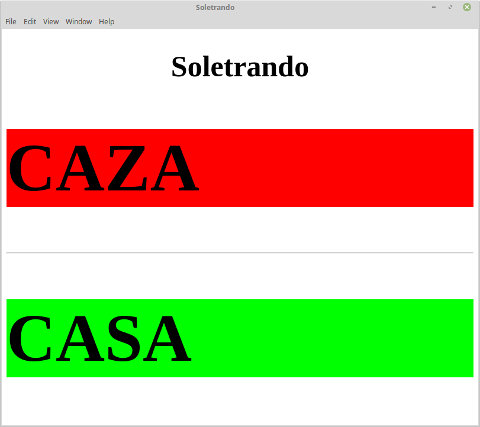
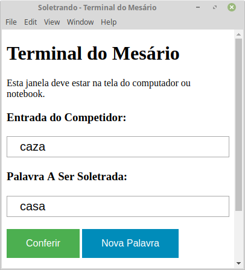

Title: Software para Auxílio na Execução de Competições de Soletração
Date: 2024-10-03
Tags: projetos

Programa para apresentação de competições de soletrando. Com correção automática das palavaras e exibição das letras
faladas em tempo real. Ideal para enrriquecer as ações e eventos educativos da sua escola.

O programa conta com duas janelas, a janela de cima deve ser arrastada para o projetor de modo que fique maximizada e
visivel para os competidores e espectadores. A segunda janela a de baixo, "Terminal do Mesário", deve ficar na tela do
notebook ou computador, de modo que fique visível apenas aos jurados ou organizadores da competição.

Caso de Uso:
Campeonato de Soletração organizado pela Unidade Escolar Fausto Lustosa em 24 de setembro de 2018. Para o qual,
desenvolveu-se um programa para auxílio na exibição e correção das palavras.
